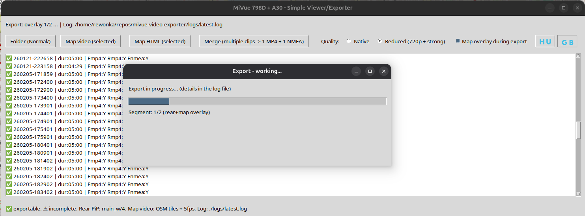

# MiVue 798D + A30 - Simple GUI Exporter (Linux/WSL)

A Python GUI tool for **Mio MiVue 798D** (front) + **MiVue A30** (rear) dashcam recordings.

It can:
- scan the camera SD-card folder structure,
- merge **front + rear** videos into one MP4 with **rear PiP overlay**,
- generate a **moving OpenStreetMap (OSM) map video** from front `.NMEA`,
- optionally burn the **map overlay video** into export,
- concatenate selected segments into one final MP4 and one combined NMEA.

Works on Linux and **WSL2** (GUI via WSLg / X server).

## Screenshot



## Expected Folder Structure

Select the **Normal/** directory (the one that contains `F/` and `R/`):

```text
Normal/
  F/
    FILEYYMMDD-HHMMSSF.MP4
    FILEYYMMDD-HHMMSSF.NMEA
  R/
    FILEYYMMDD-HHMMSSR.MP4
```

Notes:
- Rear camera typically has **no NMEA** file (GPS comes from front).
- Clips are matched by timestamp `YYMMDD-HHMMSS`.

## Requirements

### System packages (Ubuntu / WSL Ubuntu)

```bash
sudo apt update
sudo apt install -y ffmpeg python3 python3-pip python3-tk
```

### Python packages

```bash
pip install folium numpy pillow
```

## Run

```bash
python3 mivue_gui.py
```

Logs:
- `./logs/latest.log`
- `./logs/mivue_YYYYMMDD_HHMMSS.log`

Map tile cache:
- `./tiles_cache/`

## GUI Features

- **Folder (Normal/)**
  - scans clips
  - shows complete (`✅`) and incomplete (`⚠️`) entries
  - now includes a **scan progress dialog** with progress bar and current file detail
- **Map HTML (selected)**
  - creates interactive OSM HTML preview from selected NMEA tracks
- **Map video (selected)**
  - creates moving map overlay video (OSM tiles, 5 FPS, GPS/camera smoothing)
- **Merge (multiple clips -> 1 MP4 + 1 NMEA)**
  - overlays rear PiP
  - optional map overlay during export
  - outputs one merged MP4 + one merged NMEA

## Language Support

- UI is bilingual: **English + Hungarian**
- Language switcher is available in the toolbar via **flag icons** (`🇬🇧` / `🇭🇺`)
- Default language: **English**

## Quality Modes

### Native
- original resolution
- H.264: CRF 20, veryfast
- audio: AAC 128k

### Reduced
- front scaled to 720p
- H.264: CRF 26, slow
- audio: AAC 64k

## Notes

- GPS comes from front camera only
- optimized for MiVue naming scheme
- personal use tool

---


